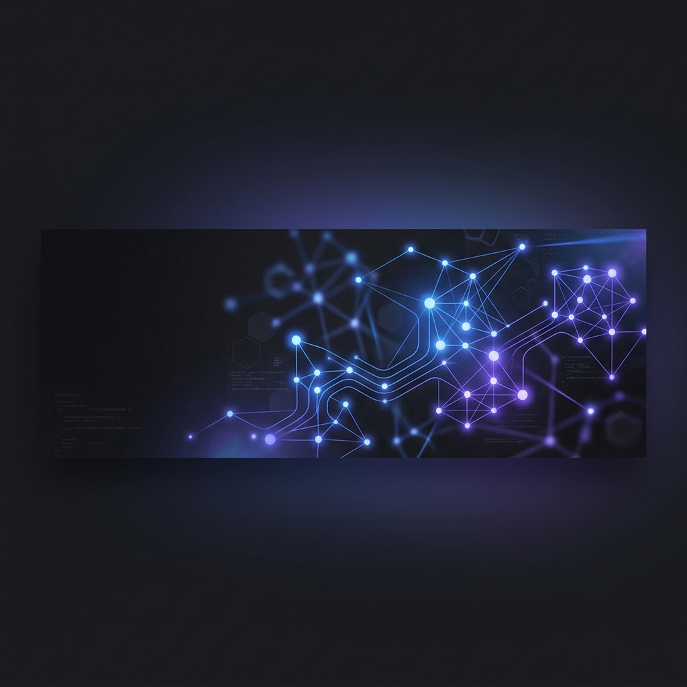

  
  
   
  
  <h1>Hi there, I'm Yogesh Singh Rajawat 👋</h1>
  
  
<strong>Full-Stack Engineer | Backend Developer</strong>

  
  

    
    
    
  

---

### 💻 About Me
**Software Developer interested in full-stack and backend systems**.

* 🌱 **Currently learning**: **Go**, **Java**, **Spring Boot**, and **Distributed Systems**.

---

### 🛠️ Languages & Technologies

<table>
  <tr>
    <td width="30%"><strong>Languages</strong></td>
    <td>
      
      
      
      
      
      
    </td>
  </tr>
  <tr>
    <td><strong>Backend & Real-Time</strong></td>
    <td>
      
      
      
      
      
      
      
    </td>
  </tr>
  <tr>
    <td><strong>Databases & Caching</strong></td>
    <td>
      
      
      
      
      
    </td>
  </tr>
  <tr>
    <td><strong>Frontend & Mobile</strong></td>
    <td>
      
      
      
      
      
    </td>
  </tr>
  <tr>
    <td><strong>DevOps & Tools</strong></td>
    <td>
      
      
      
      
    </td>
  </tr>
  <tr>
    <td><strong>Currently Learning</strong></td>
    <td>
      
      
    </td>
  </tr>
</table>

---

### 🚀 Featured Projects

#### 🌐 [Portfolio](https://yogeshrajawat.vercel.app)
My personal developer portfolio website showcasing my background, skills, and projects.
* **Core Tech**: Next.js, React, TypeScript, Tailwind CSS.

#### 🔮 [Prism AI](https://prism-ai1.vercel.app)
An AI tool that converts long-form media (YouTube videos, audio/video files, or transcripts) into platform-optimized text copy and graphics.
* **GitHub**: [yogeshsingh63/ai-atomizer](https://github.com/yogeshsingh63/ai-atomizer)
* **Core Tech**: Next.js, FastAPI (Python), PostgreSQL (Supabase), SQLite, LLMs (Gemini, Llama 3.3).
* **Key Features**: Transcribes audio inputs, generates blogs, Twitter threads, and LinkedIn posts, creates thumbnail images, and lets users edit specific assets with custom AI prompts.

#### 💻 [CodeSphere](https://codesphere1.vercel.app)
An online collaborative code editor and IDE for running and evaluating code in isolated environments.
* **GitHub**: [yogeshsingh63/codesphere](https://github.com/yogeshsingh63/codesphere)
* **Core Tech**: React, Node.js, Express, MongoDB, WebSockets, Docker.
* **Key Features**: Compiles and runs submissions inside isolated Docker containers, supports live multiplayer code collaboration via WebSockets, and evaluates submissions against test cases.

---

### 📊 GitHub Stats

  

